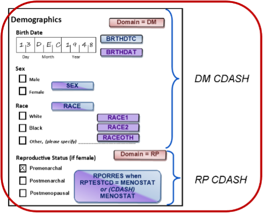
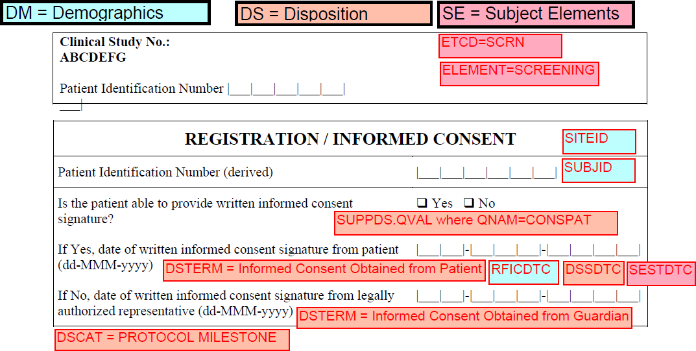
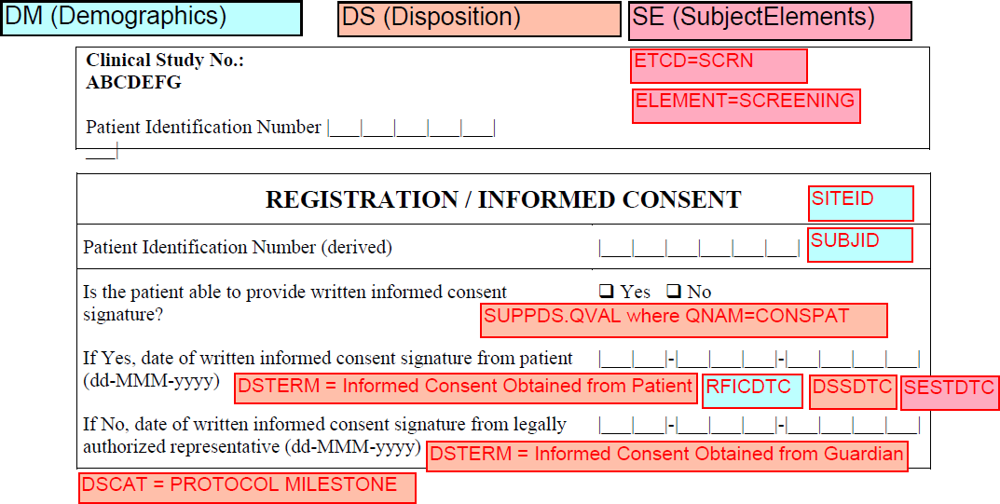

===============================================
Welcome to Annotation Exporter's documentation!
===============================================

.. toctree::
   :maxdepth: 1
   :caption: Contents:

   readme
   installation
   usage
   modules
   api
   contributing

This collection of Python programs might be useful for those people who are working at the setup of clinical studies.

Data collection in clinical studies is usually done with the help of CRFs (Case Report Forms). Today these forms are provided as electronic forms.

The text and the entry fields of these forms have to be annotated. An annotation is a comment field which gives information about the scope of the entry field and the variable name.

   Simple example of annotated CRF.
   `Image source CDISC <https://www.cdisc.org/sites/default/files/kb/CDASH_Data_CRF.png>`_, last accessed 02.11.2024.

CDISC (Clinical Data Interchange Standards Consortium) is a collection of standards which makes it easier to collaborate with other companies and authorities.

In the scope of this application SDTM (Standard Data Tabulation Model) and CDASH (Clinical Data Acquisition Standards Harmonization) are used.

The image shows already one issue which might occur. There are different versions of the standards. The domains (collections of data for a specific topic) can be annotated in different ways.

This application uses an older and a newer version of the SDTM domain annotation.

Older version

   Old domain annotation

Newer version

   New domain annotation

------------------
Indices and tables
------------------
* :ref:`genindex`
* :ref:`modindex`
* :ref:`search`
